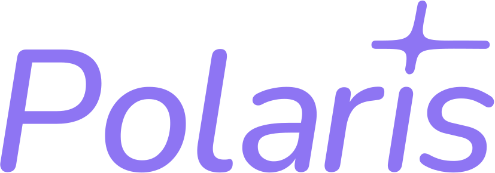

<div align="center">
    
</div>
</br>

<p align="center">
    <a href="https://polarishub.io/" target="_blank">
      ✨ Polaris Hub
  </a> |
  <a href="https://polaris-hub.github.io/polaris/" target="_blank">
      📚 Client Doc
  </a>
</p>

---

[](https://pypi.org/project/polaris-lib/)
[](https://anaconda.org/conda-forge/polaris)
[](https://pypi.org/project/polaris-lib/)
[](https://anaconda.org/conda-forge/polaris)
[](https://pypi.org/project/polaris-lib/)
[](https://github.com/polaris-hub/polaris/blob/main/LICENSE)
[](https://github.com/polaris-hub/polaris/stargazers)
[](https://github.com/polaris-hub/polaris/network/members)

[](https://github.com/polaris-hub/polaris/actions/workflows/test.yml)
[](https://github.com/polaris-hub/polaris/actions/workflows/release.yml)
[](https://github.com/polaris-hub/polaris/actions/workflows/code-check.yml)
[](https://github.com/polaris-hub/polaris/actions/workflows/doc.yml)

Polaris establishes a novel, industry‑certified standard to foster the development of impactful methods in AI-based drug discovery.

This library is a Python client to interact with the [Polaris Hub](https://polarishub.io/). It allows you to:

- Download Polaris datasets and benchmarks.
- Evaluate a custom method against a Polaris benchmark.
- Create and upload new datasets and benchmarks.

> [!WARNING]
> The Polaris Hub is currently released as a closed, private beta. We hope to officially release it early 2024.


## Quick API Tour

```python
import polaris as po

# Load the benchmark from the Hub
benchmark = po.load_benchmark("polaris/hello-world-benchmark")

# Get the train and test data-loaders
train, test = benchmark.get_train_test_split()

# Use the training data to train your model
# Get the input as an array with 'train.inputs' and 'train.targets'  
# Or simply iterate over the train object.
for x, y in train:
    ...

# Work your magic to accurately predict the test set
predictions = [0.0 for x in test]

# Evaluate your predictions
results = benchmark.evaluate(predictions)

# Submit your results
results.upload_to_hub(owner="dummy-user")
```

## Documentation

Please refer to the [documentation](https://polaris-hub.github.io/polaris/), which contains tutorials for getting started with `polaris` and detailed descriptions of the functions provided.

## Installation

You can install `polaris` using conda/mamba/micromamba:

```bash
conda install -c conda-forge polaris
```

You can also use pip:

```bash
pip install polaris-lib
```

## Development lifecycle

### Setup dev environment

```shell
conda env create -n polaris -f env.yml
conda activate polaris

pip install --no-deps -e .
```

<details>
  <summary>Other installation options</summary>
  
    Alternatively, using [uv](https://github.com/astral-sh/uv):
    ```shell
    uv venv -p 3.12 polaris
    source .venv/polaris/bin/activate
    uv pip compile pyproject.toml -o requirements.txt --all-extras
    uv pip install -r requirements.txt 
    ```   
</details>


### Tests

You can run tests locally with:

```shell
pytest
```

## License

Under the Apache-2.0 license. See [LICENSE](LICENSE).
